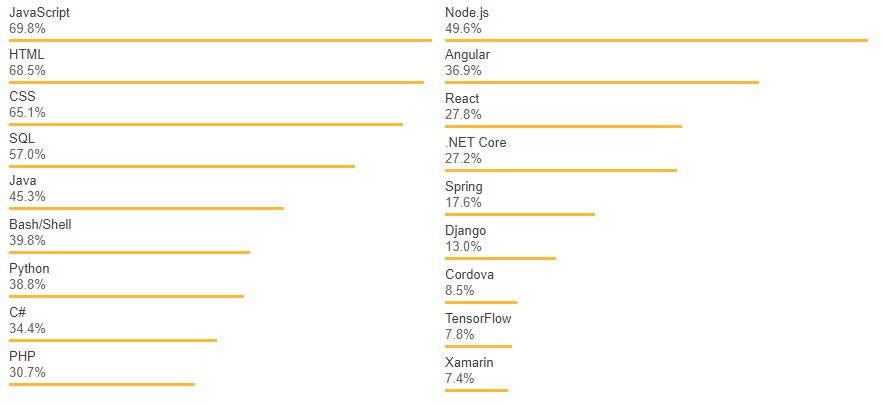
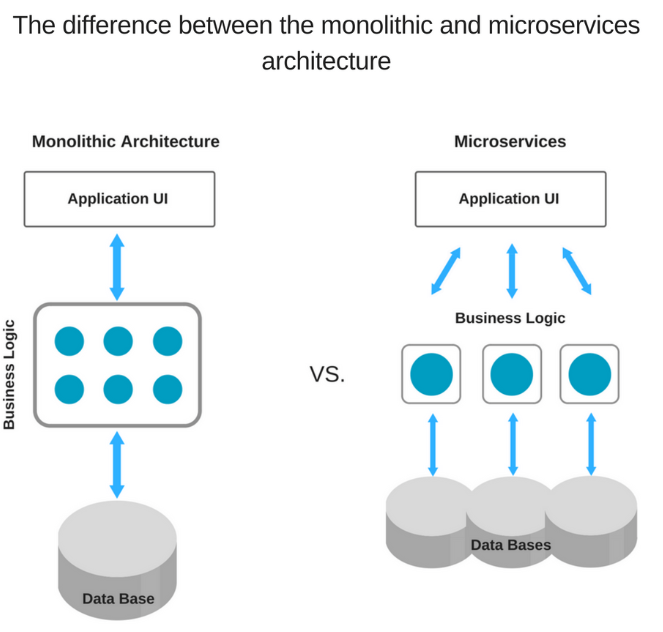

# Period-2 

### Node.js+Express, Testing with JavaScript, NoSQL with MongoDB and Mongoose

In this period we will introduce Express, a minimal and flexible node.js package, that provides a robust set of features for web and mobile applications. We will also introduce the Mocha test framework, together with a number of supplementing packages for assertions, mocking etc. Finally you will be introduced to a new kind of database - NoSQL Databases, with mongoDB as the document database.

## Node.js and Express
*Note: This description is too big for a single exam-question. It will be divided up into separate questions for the exam*

### Why would you consider a Scripting Language as JavaScript as your Backend Platform?
Let's look at the results from Stack Overflow's [developer survey for 2018](https://insights.stackoverflow.com/survey/2018#technology-programming-scripting-and-markup-languages), you'll see that JavaScript is, for the sixth year in a row, the most commonely used programming language - In addition, Node.js is also taking a lead over other frameworks. 



The reason behind this, is that, Node.js is now in a solid maturity state. It got an ever-growing community and a strong ecosystem that helped it getting over the problems it had in its early days.
 
There's a lot of advantages to working in a JavaScript environment on your server, such as:
- Since your frontend is probably running with JavaScript, you've got code universality across your stack. 
- You can reuse code on both ends and stay coherent on all system levels.
- You can write a web app that renders both on the browser and the server seamlessly.
- and [more](https://snipcart.com/blog/javascript-nodejs-backend-development)

JavaScript is only one of a plethora of popular backend languages that all got their pros & cons - However, it's important to know that it absolutely is an option to consider.

### Explain Pros & Cons in using Node.js + Express to implement your Backend compared to a strategy using, for example, Java/JAX-RS/Tomca

#### The Benefits of Node.js
**Robust Technology Stack**

JavaScript has proven to be an undisputed leader among the most popular programming languages. You can view the [2018 - Node.js User Survey Report ](https://nodejs.org/en/user-survey-report/#overview) for its usages.

Using Node.js for backend, you automatically get all the pros of full stack JavaScript development, such as:

- better efficiency and overall developer productivity
- code sharing and reuse
- speed and performance
- easy knowledge sharing within a team
- huge number of free tools

Consequently, your team is a lot more flexible, the development is less time-consuming and as a result you get fast and reliable software.

Despite a common belief, with full stack web development you are in no way limited to the traditional MEAN (MongoDB, Express.js, AngularJS, and Node.js) stack. The only must-have in this case is Node.js (there is no alternative in JavaScript for backend programming). The rest of the technologies within this stack are optional and may be replaced with some other tools providing similar functionality - read about the alternatives [Node.js Frameworks Comparison for Your Back-end Solution](https://www.altexsoft.com/blog/engineering/node-js-frameworks-comparison-for-your-back-end-solution-express-js-meteor-js-sails-js-and-more/) 

**Fast and Event-Based**

What is Node.js used for? When using a common language for both client- and server-side, synchronization happens fast, which is especially helpful for event-based, real-time applications. Thanks to its asynchronous, non-blocking, single-threaded nature, Node.js is a popular choice for online gaming, chats, video conferences, or any solution that requires constantly updated data.

Not only does app performance benefit from Node.js’ lightness, the team’s productivity will increase as well. Developers trained in frontend JavaScript can start programming the server side with the minimum learning curve. With the same language on both sides, you can reuse code on front-end and back-end by wrapping it into modules and creating a new level of abstraction.

**Scalable Technology for Microservices**

Since it’s a lightweight technology tool, using Node.js for microservices architecture is a great choice. This architectural style is best described by Martin Fowler and James Lewis as 

*“an approach to developing a single application as a suite of small services, each running in its own process and communicating with lightweight mechanisms, often an HTTP resource API.”*

Accordingly, breaking the application logic into smaller modules, microservices, instead of creating a single, large monolithic core, you enable better flexibility and lay the groundwork for further growth. As a result, it is much easier to add more microservices on top of the existing ones than to integrate additional features with the basic app functionality.



With each microservice communicating with the database directly through streams, such architecture allows for better performance and speed of application.

**Rich Ecosystem**

One word – npm, a default Node.js package manager, it also serves as a marketplace for open source JavaScript tools, which plays an important role in the advance of this technology. With about 350,000 tools available in the npm registry as of now, and over 10,000 new ones being published every week, the Node.js ecosystem is quite rich.

With such a vast variety of free tools accessible in a few clicks, there is a huge potential for the use of Node.js. At the same time, open source software enjoys a growing popularity as it allows you to build new solutions reducing the overall costs of development and time to market.

#### The Drawbacks of Node.js
**Performance Bottlenecks and Design Issues**

Two of the most argued about aspects of Node.js programming are its insufficiency with heavy computations and the so-called *“callback hell”*. Before we get into too many details, let’s figure out what’s what.

As we know, JavaScript (and, as a result, Node.js) is asynchronous by nature and has a non-blocking I/O model. This means, it can process several simple tasks (for example, read/write database queries) queued in the background without blocking the main thread and do so quickly.

At the same time, Node.js is a single-threaded environment, which is often considered a serious drawback of the technology. Indeed, in some cases, a CPU-bound task (number crunching, various calculations) can block the event loop resulting in seconds of delay for all Node.js website users.

This represents a serious issue. That is why, to avoid it, it is recommended not to use Node.js with computation-heavy systems.

Due to its asynchronous nature, Node.js relies heavily on callbacks, the functions that run after each task in the queue is finished. Keeping a number of queued tasks in the background, each with its callback, might result in the so-called callback hell, which directly impacts the quality of code. Simply put, it’s a *“situation where callbacks are nested within other callbacks several levels deep, potentially making it difficult to understand and maintain the code.”*

```javascript
fs.readdir(source, function (err, files) {
  if (err) {
    console.log('Error finding files: ' + err)
  } else {
    files.forEach(function (filename, fileIndex) {
      console.log(filename)
      gm(source + filename).size(function (err, values) {
        if (err) {
          console.log('Error identifying file size: ' + err)
        } else {
          console.log(filename + ' : ' + values)
          aspect = (values.width / values.height)
          widths.forEach(function (width, widthIndex) {
            height = Math.round(width / aspect)
            console.log('resizing ' + filename + 'to ' + height + 'x' + height)
            this.resize(width, height).write(dest + 'w' + width + '_' + filename, function(err) {
              if (err) console.log('Error writing file: ' + err)
            })
          }.bind(this))
        }
      })
    })
  }
})
```

Yet, this is often considered a sign of poor coding standards and lack of experience with JavaScript and Node.js in particular. The code, represented above, can be refactored and simplified, in just a few steps, as shown at [callbackhell.com](http://callbackhell.com/).

**Immaturity of Tooling**

Although, the core Node.js modules are quite stable and can be considered mature, there are many tools in the npm registry which are either of poor quality or not properly documented/tested. Moreover, the registry itself isn’t structured well enough to offer the tools based on their rating or quality. Hence it might be difficult to find the best solution for your purposes without knowing what to look for.

The fact that the Node.js ecosystem is mostly open source, has its impact as well. While the quality of the core Node.js technology is supervised by Joyent and other major contributors, the rest of the tools might lack the quality and high coding standards set by global organizations.

#### Conclusion

Obviously, with all the listed Node.js advantages and disadvantages, the technology is no silver bullet. But neither is Java, .Net framework or PHP. Yet, there are specific cases where each one of the technologies perform best. For Node.js, these are real-time applications with intense I/O, requiring speed and scalability.

This might be social networks, gaming apps, live chats or forums as well as stock exchange software or ad servers, where speed is everything. Fast and scalable, Node.js is the technology of choice for data-intensive, real-time IoT devices and applications.

Due to its non-blocking architecture, Node.js works well for encoding and broadcasting video and audio, uploading multiple files, and data streaming.

Recently, Node.js has been actively used in enterprise-level software. While there is still much argument about this, many large companies and global organizations, such as NASA, have already adopted Node.js. And the enterprise Node.js ecosystem continues to mature.

However, you can’t choose a language or tool just because another super-successful company did. It makes no sense to look at the others when your product and your business is at stake. You need to clearly identify the benefits the technology will give you, without forgetting about the hidden drawbacks.

ref: [The Good and the Bad of Node.js - Web App Development](https://www.altexsoft.com/blog/engineering/the-good-and-the-bad-of-node-js-web-app-development/)

### Node.js uses a Single Threaded Non-blocking strategy to handle asynchronous task. Explain strategies to implement a Node.js based server architecture that still could take advantage of a multi-core Server.
 
### Explain briefly how to deploy a Node/Express application including how to solve the following deployment problems:


#### a) Ensure that you Node-process restarts after a (potential) exception that closed the application

#### b) Ensure that you Node-process restarts after a server (Ubuntu) restart

#### c) Ensure that you can take advantage of a multi-core system

#### d) Ensure that you can run “many” node-applications on a single droplet on the same port (80

### Explain the difference between “Debug outputs” and application logging. What’s wrong with console.log(..) statements in our backend-code.

### Demonstrate a system using application logging and *coloured* debug statements.

### Explain, using relevant examples, concepts related to testing a REST-API using Node/JavaScript + relevant packages 

### Explain, using relevant examples, the Express concept - Middleware.

### Explain, using relevant examples, how to implement sessions and the legal implications of doing this.
  
### Compare the express strategy toward (server side) templating with the one you used with Java on second semester.
  
### Demonstrate a simple Server Side Rendering example using a technology of your own choice (pug, EJS, ..).
  
### Explain, using relevant examples, your strategy for implementing a REST-API with Node/Express and show how you can "test" all the four CRUD operations programmatically using, for example, the Request package.
  
### Explain, using relevant examples, about testing JavaScript code, relevant packages (Mocha etc.) and how to test asynchronous code.
  
### Explain, using relevant examples, different ways to mock out databases, HTTP-request etc.

### Explain, preferably using an example, how you have deployed your node/Express applications, and which of the Express Production best practices you have followed.

## NoSQL, MongoDB and Mongoose

### Explain, generally, what is meant by a NoSQL database.

### Explain Pros & Cons in using a NoSQL database like MongoDB as your data store, compared to a traditional Relational SQL Database like MySQL.

### Explain reasons to add a layer like Mongoose, on top on of a schema-less database like MongoDB

### Demonstrate, using a REST-API you have designed, how to perform all CRUD operations on a MongoDB

### Explain the benefits of using Mongoose, and demonstrate, using your own code, an example involving all CRUD operations

### Explain the “6 Rules of Thumb: Your Guide Through the Rainbow” as to how and when you would use normalization vs. denormalization.

### Demonstrate, using your own code-samples, decisions you have made regarding → normalization vs denormalization 

### Explain, using a relevant example, a full JavaScript backend including relevant test cases to test the REST-API (not on the production database)

### __***These two topics will be introduced in period-3***__
- Explain about indexes in MongoDB, how to create them, and demonstrate how you have used them.
- Explain, using your own code examples, how you have used some of MongoDB's "special" indexes like TTL and 2dsphere
